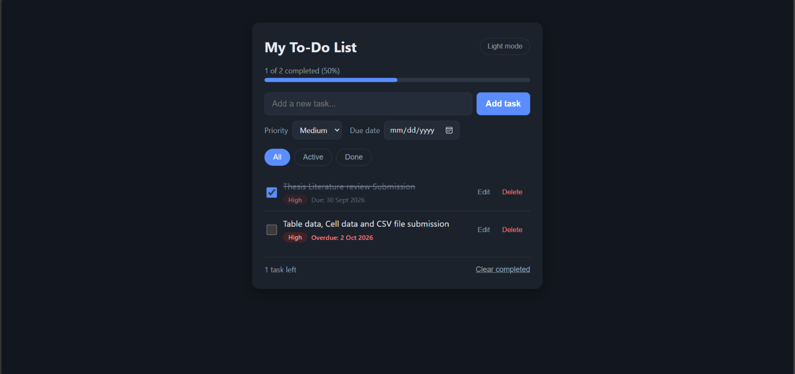

# To-Do App

A clean and responsive To-Do app built with HTML, CSS and vanilla JavaScript. Tasks are saved in the browser, so they stay even after you refresh the page.

**Live demo:** https://iftakheremon.github.io/todo-app/



## Features

- Add, edit, delete and complete tasks
- Priority levels: Low, Medium, High (color badges)
- Due dates with overdue highlight
- Filter tasks: All, Active, Done
- Progress bar showing completed percentage
- Dark and light mode (remembers your choice)
- Clear all completed tasks in one click
- Data saved with localStorage
- Responsive design for mobile and desktop
- Keyboard support: Enter to add or save, Esc to cancel edit

## Built With

- HTML5
- CSS3 (Flexbox, CSS variables, media queries)
- JavaScript (ES6, DOM manipulation, localStorage)

## Project Structure

```
todo-app/
├── index.html
├── css/
│   └── style.css
├── js/
│   └── script.js
├── screenshots/
│   └── preview.png
└── README.md
```

## How to Run Locally

1. Clone the repository
```bash
   git clone https://github.com/IftakherEmon/todo-app.git
```
2. Open the folder
```bash
   cd todo-app
```
3. Open `index.html` in your browser (or use the VS Code Live Server extension)

## What I Learned

- Managing app state with arrays and objects
- DOM manipulation and event delegation
- Saving and loading data with localStorage
- Building a responsive UI with CSS variables and dark mode

## Future Improvements

- Drag and drop to reorder tasks
- Task categories and search
- Export and import tasks

## Author

**Iftakher Emon**
GitHub: [@IftakherEmon](https://github.com/IftakherEmon)
